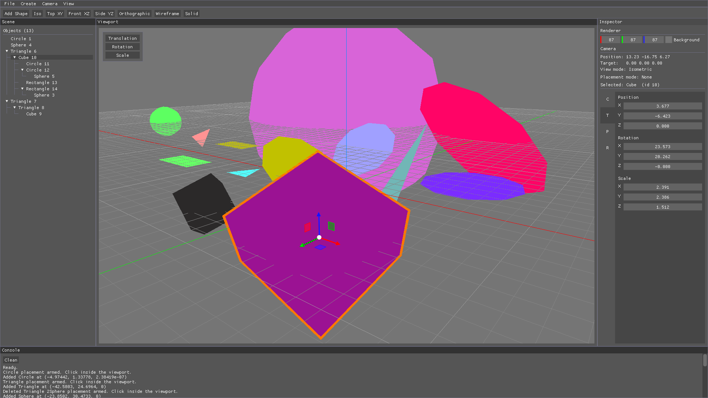
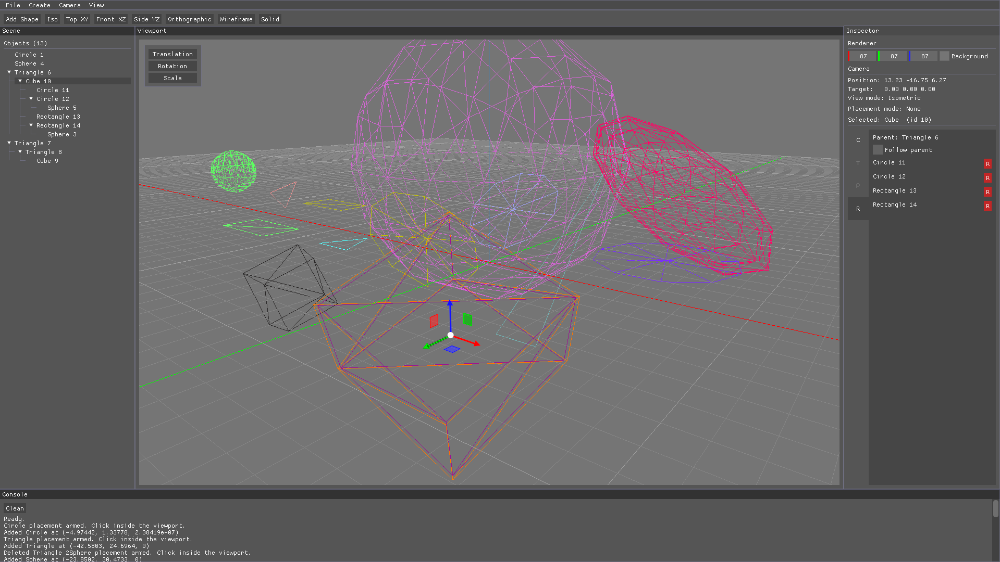

# SliyanEngine

#### Solid

#### Wireframe

### A 3D creation tool where users can add and manipulate objects such as light and meshes, while visualising physical simulations like gravity, lighting and real world effects in real time
### Inspired from Blender, Houdini and several game engines

Current build has:

- Viewport Renderer
- GridAxis Renderer
- Selectable shapes
- Gizmo
  - Translation
  - Rotation
  - Scale
- Add Shapes
  - Triangle
  - Circle
  - Rectangle
  - Cube
  - Circle
- Delete Shapes
- Shape Scene hierarchy
- Camera
  - Movement
  - Isometric and Perspective
  - Top (XY) for future 2D implementations
  - Front (XZ) and Side (YZ)
- Console
- UI

Tools used:

- Dear ImGui
- ImGuizmo
- OpenGL
- Neovim
