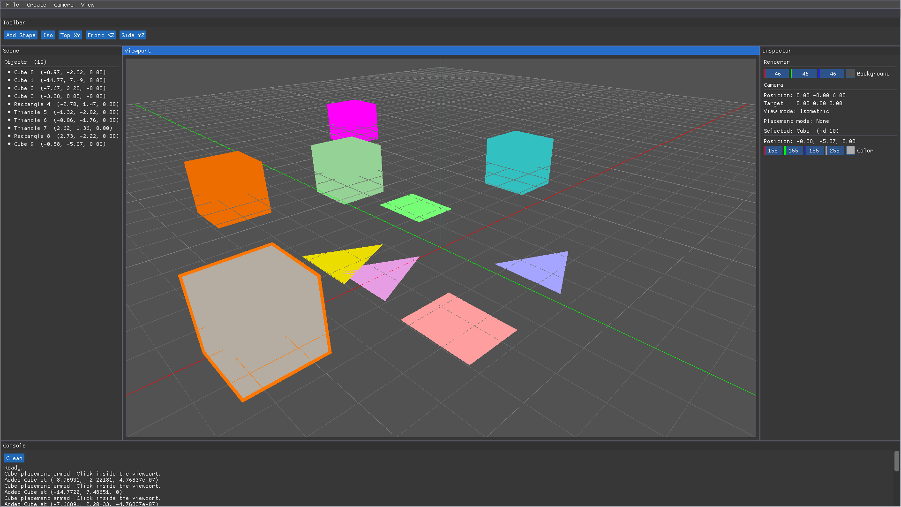

# SliyanEngine

### A 3D creation tool where users can add and manipulate objects such as light and meshes, while visualising physical simulations like gravity, lighting and real world effects in real time
### Inspired from Blender, Houdini and several game engines

Current build has:

- Viewport Renderer
- GridAxis Renderer
- Add Shapes
  - Triangles
  - List shapes added in UI (Scene Panel)
- Camera system
  - Isometric
  - Top (XY) for future 2D implementations
  - Front (XZ) and Side (YZ)
- Console
  - Message actions
- UI

Tools used:

- Dear ImGui
- OpenGL
- Neovim
